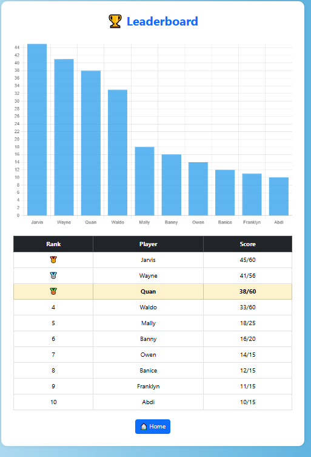

# 🧠 Quiz App with Leaderboard

- A stage-based, animated quiz web app built using Flask. 
- Supports real-time feedback, persistent leaderboard, and session tracking.

---

## 🚀 Features

- 📚 **Stage-based quiz** — Questions grouped by stages with progression.
- ⏱ **Timer support** — Each question is time-bound.
- 📝 **Multiple-choice questions** — Easy and interactive format.
- ✅ **Instant feedback** — Correct/incorrect answers shown immediately.
- 🏆 **Leaderboard** — Tracks top scores across all users (stored in JSON).
- 👤 **Username support** — Players can enter and save their usernames.
- 💻 **Simple UI** — Clean interface built with HTML, CSS, and Bootstrap.

---


## 🧰 Tech Stack

- **Backend:** [Flask](https://flask.palletsprojects.com/) (Python microframework)  
- **Frontend:**  
  - [HTML5](https://developer.mozilla.org/docs/Web/HTML)  
  - [CSS3](https://developer.mozilla.org/docs/Web/CSS)  
  - [Bootstrap](https://getbootstrap.com/) (for responsive design)  
- **Templating Engine:** [Jinja2](https://jinja.palletsprojects.com/) (integrated with Flask)  
- **Data Storage:** JSON files (for storing quiz questions & leaderboard)  
- **Deployment:** [Render](https://www.render.com/) (via Procfile)  
- **Version Control:** [Git](https://git-scm.com/) & [GitHub](https://github.com/)  


---

## 📦 Installation

```bash
 git clone https://github.com/harizonelopez/quiz-app.git
 cd quiz-app
 pip install -r requirements.txt

```
---

## Create Virtual Environment (Recommended)
```bash
 python -m venv venv
 source venv/bin/activate   # On Linux/Mac
 venv\Scripts\activate      # On Windows

```
---

## ▶️ Running the App

```bash
 python run.py

```

- Then open `http://127.0.0.1:5000` in your browser.

---

## 🧩 Usage

1. Open the app in your browser.

2. Enter your username to start playing.

3. Answer quiz questions within the time limit.

4. Progress through stages as you succeed.

5. Check your score on the Leaderboard tab.




